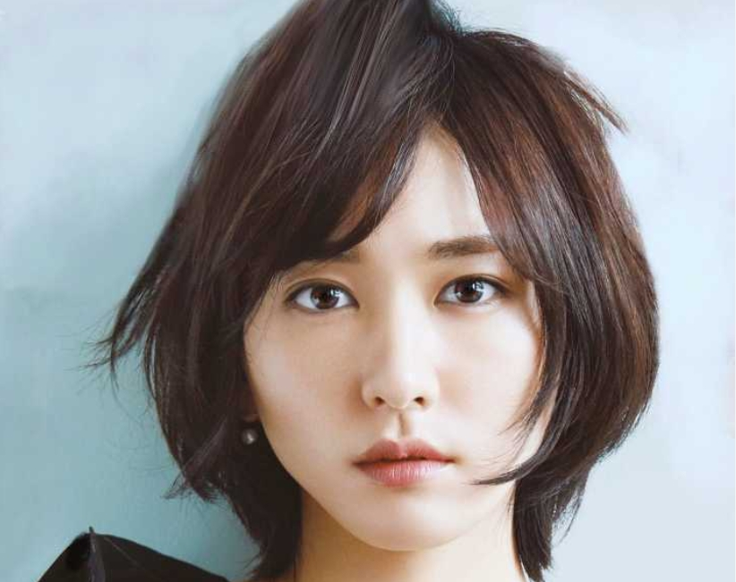

# AdaFace-Animate

This folder contains the preliminary implementation of **AdaFace-Animate**.
It is a zero-shot subject-guided animation generator conditioned with human subject images, by combining AnimateDiff, ID-Animator and AdaFace. The ID-Animator provides AnimateDiff with rough subject characteristics, and AdaFace provides refined and more authentic subject facial details.

Please refer to our NeurIPS 2024 submission for more details about AdaFace:
 
**AdaFace: A Versatile Face Encoder for Zero-Shot Diffusion Model Personalization** 
</br>

[](https://huggingface.co/spaces/adaface-neurips/adaface-animate)

This pipeline uses 4 pretrained models: [Stable Diffusion V1.5](https://huggingface.co/runwayml/stable-diffusion-v1-5), [AnimateDiff v3](https://github.com/guoyww/animatediff), [ID-Animator](https://github.com/ID-Animator/ID-Animator) and [AdaFace](https://huggingface.co/adaface-neurips/adaface).

AnimateDiff uses a SD-1.5 type checkpoint, referred to as a "DreamBooth" model. The DreamBooth model we use is an average of three SD-1.5 models named as "SAR": the original [Stable Diffusion V1.5](https://huggingface.co/runwayml/stable-diffusion-v1-5/blob/main/v1-5-pruned.safetensors), [AbsoluteReality V1.8.1](https://civitai.com/models/81458?modelVersionId=132760), and [RealisticVision V4.0](https://civitai.com/models/4201?modelVersionId=114367). In our experiments, this average model performs better than any of the individual models.

## Procedures of Generation
We find that using an initial image helps stablize the animation sequence and improve the quality. When generating each example video, an initial image is first generated by AdaFace with the same prompt as used to generate the video. This image is blended with multiple frames of random noises with weights decreasing with $t$. The multi-frame blended noises are converted to a 1-second animation with AnimateDiff, conditioned by both AdaFace and ID-Animator embeddings. 

## Gallery
[Gallery](./assets/) contains 100 subject videos generated by us. They belong to 10 celebrities, each with 10 different prompts. The (shortened) prompts are: "Armor Suit", "Iron Man Costume", "Superman Costume", "Wielding a Lightsaber", "Walking on the beach", "Cooking", "Dancing", "Playing Guitar", "Reading", and "Running".

Some example videos are shown below. The full set of videos can be found in [Gallery](./assets/).

(Hint: use the horizontal scroll bar at the bottom of the table to view the full table)

<table class="center" style="table-layout: fixed; width: 100%; overflow-x: auto;">
    <tr style="line-height: 1">
        <td width="25%" style="text-align: center">Input (Celebrities)</td>
        <td width="25%" style="text-align: center">Animation 1: Playing Guitar</td>
        <td width="25%" style="text-align: center">Animation 2: Cooking</td>
        <td width="25%" style="text-align: center">Animation 3: Dancing</td>
    </tr>
    <tr>
        <td style="text-align: center"></td>
        <td style="text-align: center"><video width="100%" controls src="https://github.com/siberianlynx/video-demos/assets/77731289/c7959b10-90c5-4f86-9c32-7d31027e5680" type="video/mp4"></video></td>
        <td style="text-align: center"><video width="100%" controls src="https://github.com/siberianlynx/video-demos/assets/77731289/f14d0d9f-4f24-45f8-8836-7e90c18054f4" type="video/mp4"></video></td>
        <td style="text-align: center"><video width="100%" controls src="https://github.com/siberianlynx/video-demos/assets/77731289/838e14fb-da0f-4e65-b537-42f8138d0145" type="video/mp4"></video></td>
    </tr>
    <tr>
        <td style="text-align: center"></td>
        <td style="text-align: center"><video width="100%" controls src="https://github.com/siberianlynx/video-demos/assets/77731289/5316c706-1d0d-4df1-acb1-98acda2de12e" type="video/mp4"></video></td>
        <td style="text-align: center"><video width="100%" controls src="https://github.com/siberianlynx/video-demos/assets/77731289/f8640f33-8351-41bf-9737-b394953eb268" type="video/mp4"></video></td>
        <td style="text-align: center"><video width="100%" controls src="https://github.com/siberianlynx/video-demos/assets/77731289/c8d191d1-6628-4134-9b62-1a8d9f112085" type="video/mp4"></video></td>
    </tr>
    <tr>
        <td style="text-align: center"></td>
        <td style="text-align: center"><video width="100%" controls src="https://github.com/siberianlynx/video-demos/assets/77731289/d97ee268-ec58-44bc-a789-142f4c6ff138" type="video/mp4"></video></td>
        <td style="text-align: center"><video width="100%" controls src="https://github.com/siberianlynx/video-demos/assets/77731289/90e21d5c-2c60-479e-8899-4723cbc9694d" type="video/mp4"></video></td>
        <td style="text-align: center"><video width="100%" controls src="https://github.com/siberianlynx/video-demos/assets/77731289/53fa9136-e371-45a0-bd1a-972b50ce3c6c" type="video/mp4"></video></td>
    </tr>

</table>

To illustrate the wide range of applications of our method, we animated 8 internet memes. 4 of them are shown in the table below. The full gallery can be found in [memes](./assets/memes/).

<table class="center">
    <tr style="line-height: 1">
    <td width=25% style="text-align: center">Input (Memes)</td>
    <td width=25% style="text-align: center">Animation</td>
    <td width=25% style="text-align: center">Input</td>
    <td width=25% style="text-align: center">Animation</td>
    </tr>
    <tr>
    <td style="text-align: center">Yao Ming Laugh</td><td></td><td style="text-align: center">Girl Burning House</td></td><td>
    </tr>
    <tr>
    <td></td>
    <td><video width="100%" controls src="https://github.com/siberianlynx/video-demos/assets/77731289/8ad4ec22-0ee4-4a6a-ac41-d9d2a0b186db" type="video/mp4"></video></td>
    <td></td>
    <td><video width="100%" controls src="https://github.com/siberianlynx/video-demos/assets/77731289/5a731e00-064b-413a-9e23-cf55cd519a9f" type="video/mp4"></video></td>
    </tr>
    <tr>
    <td style="text-align: center">Girl with a Pearl Earring</td><td></td><td style="text-align: center">Great Gatsby</td></td><td>
    </tr>        
    <tr>
    <td></td>
    <td><video width="100%" controls src="https://github.com/siberianlynx/video-demos/assets/77731289/f8f4bddf-5608-43eb-99ee-d154cbc57cca" type="video/mp4"></video></td>
    <td></td>
    <td><video width="100%" controls src="https://github.com/siberianlynx/video-demos/assets/77731289/5e5b67b3-0341-4f74-a4b7-b2e9b59851e1" type="video/mp4"></video></td>
    </tr>
</table>

## Comparison with ID-Animator, with AdaFace Initial Images
To compare with the baseline method "ID-Animator", for each video, we disable AdaFace, and generate the corresponding video with ID-Animator, using otherwise identical settings: the same subject image(s) and initial image, and the same random seed and prompt. The table below compares some of these videos side-by-side with the AdaFace-Animate videos. The full set of ID-Animator videos can be found in each subject folder in [Gallery](./assets/), named as "* orig.mp4".

**NOTE** Since ID-Animator videos utilize initial images generated by **AdaFace**, this gives ID-Animator an advantage over the original ID-Animator. 

(Hint: use the horizontal scroll bar at the bottom of the table to view the full table)

<table class="center" style="table-layout: fixed; width: 100%; overflow-x: auto;">
    <tr style="line-height: 1">
        <td width="14%" style="text-align: center; white-space: normal; word-wrap: break-word;">Initial Image: Playing Guitar</td>
        <td width="18%" style="text-align: center; white-space: normal; word-wrap: break-word;">ID-Animator: Playing Guitar</td>
        <td width="18%" style="text-align: center; white-space: normal; word-wrap: break-word;">AdaFace-Animate: Playing Guitar</td>
        <td width="14%" style="text-align: center; white-space: normal; word-wrap: break-word;">Initial Image Dancing</td>
        <td width="18%" style="text-align: center; white-space: normal; word-wrap: break-word;">ID-Animator: Dancing</td>
        <td width="18%" style="text-align: center; white-space: normal; word-wrap: break-word;">AdaFace-Animate: Dancing</td>
    </tr>
    <tr>
        <td style="text-align: center"></td>
        <td style="text-align: center"><video width="100%" controls src="https://github.com/siberianlynx/video-demos/assets/77731289/f5d0f2c6-f4bd-4517-bfa1-021db1577895" type="video/mp4"></video></td>
        <td style="text-align: center"><video width="100%" controls src="https://github.com/siberianlynx/video-demos/assets/77731289/c7959b10-90c5-4f86-9c32-7d31027e5680" type="video/mp4"></video></td>
        <td style="text-align: center"></td>            
        <td style="text-align: center"><video width="100%" controls src="https://github.com/siberianlynx/video-demos/assets/77731289/421f5b81-e1a7-459a-869a-f7f6dc51a74e" type="video/mp4"></video></td>
        <td style="text-align: center"><video width="100%" controls src="https://github.com/siberianlynx/video-demos/assets/77731289/838e14fb-da0f-4e65-b537-42f8138d0145"
        type="video/mp4"></video></td>
    </tr>
    <tr>
        <td style="text-align: center"></td>
        <td style="text-align: center"><video width="100%" controls src="https://github.com/siberianlynx/video-demos/assets/77731289/3bbfc15b-4205-4052-b5cc-c4f8d6d17027" type="video/mp4"></video></td>
        <td style="text-align: center"><video width="100%" controls src="https://github.com/siberianlynx/video-demos/assets/77731289/5316c706-1d0d-4df1-acb1-98acda2de12e" type="video/mp4"></video></td>
        <td style="text-align: center"></td>
        <td style="text-align: center"><video width="100%" controls src="https://github.com/siberianlynx/video-demos/assets/77731289/75e191f4-87e2-486c-90e7-c9e21a1bf494" type="video/mp4"></video></td>
        <td style="text-align: center"><video width="100%" controls src="https://github.com/siberianlynx/video-demos/assets/77731289/c8d191d1-6628-4134-9b62-1a8d9f112085"
         type="video/mp4"></video></td>
    </tr>
    <tr>
        <td style="text-align: center"></td>
        <td style="text-align: center"><video width="100%" controls src="https://github.com/siberianlynx/video-demos/assets/77731289/6a5579ce-23e3-4603-8917-00a16d6a3682" type="video/mp4"></video></td>
        <td style="text-align: center"><video width="100%" controls src="https://github.com/siberianlynx/video-demos/assets/77731289/d97ee268-ec58-44bc-a789-142f4c6ff138" type="video/mp4"></video></td>
        <td style="text-align: center"></td>
        <td style="text-align: center"><video width="100%" controls src="https://github.com/siberianlynx/video-demos/assets/77731289/28082e58-a0ed-4492-8c51-cb563f92baeb" type="video/mp4"></video></td>
        <td style="text-align: center"><video width="100%" controls src="https://github.com/siberianlynx/video-demos/assets/77731289/53fa9136-e371-45a0-bd1a-972b50ce3c6c" type="video/mp4"></video></td>
    </tr>

</table>

The table below compares the animated internet memes. The initial image for each video is the meme image itself. For "Yao Ming laughing" and "Great Gatsby", 2~3 extra portrait photos of the subject are included as the subject images to enhance the facial fidelity. For other memes, the subject image is only the meme image. The full set of ID-Animator meme videos can be found in [memes](./assets/memes/), named as "* orig.mp4". 

<table class="center" style="width: 60%;">
    <tr style="line-height: 1">
    <td width=20% style="text-align: center">Input (Memes)</td>
    <td width=20% style="text-align: center">ID-Animator</td>
    <td width=20% style="text-align: center">AdaFace-Animate</td>
    </tr>
    <tr>
    <td></td>
    <td><video width="100%" controls src="https://github.com/siberianlynx/video-demos/assets/77731289/9daf814c-ae8a-476d-9c32-fa9ef6be16d9" type="video/mp4"></video></td>
    <td><video width="100%" controls src="https://github.com/siberianlynx/video-demos/assets/77731289/8ad4ec22-0ee4-4a6a-ac41-d9d2a0b186db" type="video/mp4"></video></td>
    <tr>
    <td></td>
    <td><video width="100%" controls src="https://github.com/siberianlynx/video-demos/assets/77731289/05ed29d5-4eaa-4a0a-bee2-bc77e5649f58" type="video/mp4"></video></td>
    <td><video width="100%" controls src="https://github.com/siberianlynx/video-demos/assets/77731289/f8f4bddf-5608-43eb-99ee-d154cbc57cca" type="video/mp4"></video></td>
    </tr>
</table>

We can see that the subjects in AdaFace-Animate videos have more authentic facial features and better preserve the facial expressions, while the subjects in ID-Animator videos are less authentic and faithful to the original images.

## Comparison with ID-Animator, without AdaFace Initial Images
To exclude the effects of AdaFace, we generate a subset of videos with AdaFace-Animate / ID-Animator *without initial images*. These videos were generated under the same settings as above, except not using initial images. The table below shows a selection of the videos. The complete set of such videos can be found in [no-init](./assets/no-init/). It can be seen that without the benefit of AdaFace initial images, the performance discrepancy between AdaFace-Animate and ID-Animator becomes more pronounced.

(Hint: use the horizontal scroll bar at the bottom of the table to view the full table)

<table class="center" style="table-layout: fixed; width: 100%; overflow-x: auto;">
    <tr style="line-height: 1">
        <td width="20%" style="text-align: center; white-space: normal; word-wrap: break-word;">Input (Celebrities)</td>
        <td width="20%" style="text-align: center; white-space: normal; word-wrap: break-word;">ID-Animator: Playing Guitar</td>
        <td width="20%" style="text-align: center; white-space: normal; word-wrap: break-word;">AdaFace-Animate: Playing Guitar</td>
        <td width="20%" style="text-align: center; white-space: normal; word-wrap: break-word;">ID-Animator: Dancing</td>
        <td width="20%" style="text-align: center; white-space: normal; word-wrap: break-word;">AdaFace-Animate: Dancing</td>
    </tr>
    <tr>
        <td style="text-align: center"></td>
        <td style="text-align: center"><video width="100%" controls src="https://github.com/siberianlynx/video-demos/assets/77731289/2c3fa70b-4a38-48d1-aead-cd94976f6beb" type="video/mp4"></video></td>
        <td style="text-align: center"><video width="100%" controls src="https://github.com/siberianlynx/video-demos/assets/77731289/99e30845-1b15-4f4e-a8da-0028f0e46e09" type="video/mp4"></video></td>
        <td style="text-align: center"><video width="100%" controls src="https://github.com/siberianlynx/video-demos/assets/77731289/2de5cb38-f62c-4e9d-90ad-9bbb72d1ba7a" type="video/mp4"></video></td>
        <td style="text-align: center"><video width="100%" controls src="https://github.com/siberianlynx/video-demos/assets/77731289/0ef028ee-4be4-4f8b-bb37-daf6c484305a" type="video/mp4"></video></td>
    </tr>
    <tr>
        <td style="text-align: center"></td>
        <td style="text-align: center"><video width="100%" controls src="https://github.com/siberianlynx/video-demos/assets/77731289/7f7f8cd0-7ca3-47b4-a44d-8c6b399bdbc4" type="video/mp4"></video></td>
        <td style="text-align: center"><video width="100%" controls src="https://github.com/siberianlynx/video-demos/assets/77731289/f76e66c3-aba5-4cdc-808c-499730fd65db" type="video/mp4"></video></td>
        <td style="text-align: center"><video width="100%" controls src="https://github.com/siberianlynx/video-demos/assets/77731289/c8b32a0d-eb11-4470-bb81-dc6cb034f1e8" type="video/mp4"></video></td>
        <td style="text-align: center"><video width="100%" controls src="https://github.com/siberianlynx/video-demos/assets/77731289/2e3d6ad0-0d73-4af7-b835-c59fbea69e53" type="video/mp4"></video></td>
    </tr>
    <tr>
        <td style="text-align: center"></td>
        <td style="text-align: center"><video width="100%" controls src="https://github.com/siberianlynx/video-demos/assets/77731289/0a512bda-aba9-4a12-9081-85d325a81d2d" type="video/mp4"></video></td>
        <td style="text-align: center"><video width="100%" controls src="https://github.com/siberianlynx/video-demos/assets/77731289/1bb06dfa-f0d7-4387-9eca-0be7885fbf1c" type="video/mp4"></video></td>
        <td style="text-align: center"><video width="100%" controls src="https://github.com/siberianlynx/video-demos/assets/77731289/3fcab66a-0f54-462f-a839-738e3927a100" type="video/mp4"></video></td>
        <td style="text-align: center"><video width="100%" controls src="https://github.com/siberianlynx/video-demos/assets/77731289/158982e0-9656-411d-bbfb-d0350e1765c9" type="video/mp4"></video></td>
    </tr>

</table>

## Installation

### Manually Download Model Checkpoints
- Download Stable Diffusion V1.5 into ``animatediff/sd``:

  ``git clone https://huggingface.co/runwayml/stable-diffusion-v1-5 animatediff/sd``
- Download AnimateDiff motion module into ``models/v3_sd15_mm.ckpt``: https://huggingface.co/guoyww/animatediff/blob/main/v3_sd15_mm.ckpt
- Download Animatediff adapter into ``models/v3_adapter_sd_v15.ckpt``:  https://huggingface.co/guoyww/animatediff/blob/main/v3_sd15_adapter.ckpt
- Download ID-Animator checkpoint into ``models/animator.ckpt`` from: https://huggingface.co/spaces/ID-Animator/ID-Animator/blob/main/animator.ckpt
- Download CLIP Image encoder into ``models/image_encoder/`` from: https://huggingface.co/spaces/ID-Animator/ID-Animator/tree/main/image_encoder
- Download AdaFace checkpoint into ``models/adaface/`` from: https://huggingface.co/adaface-neurips/adaface/tree/main/subjects-celebrity2024-05-16T17-22-46_zero3-ada-30000.pt

### Prepare the SAR Model

Manually download the three `.safetensors` models: the original [Stable Diffusion V1.5](https://huggingface.co/runwayml/stable-diffusion-v1-5/blob/main/v1-5-pruned.safetensors), [AbsoluteReality V1.8.1](https://civitai.com/models/81458?modelVersionId=132760), and [RealisticVision V4.0](https://civitai.com/models/4201?modelVersionId=114367). Save them to `models/sar`.

Run the following command to generate an average of the three models:
```
python3 scripts/avgemb.py --input models/sar/absolutereality_v181.safetensors models/sar/realisticVisionV40_v40VAE.safetensors models/sar/v1-5-pruned.safetensors --output models/sar/sar.safetensors
```

Optionally, you can replace the VAE of the SAR model with the [MSE-840000 finetuned VAE](https://huggingface.co/stabilityai/sd-vae-ft-mse-original/tree/main) for slightly better animations:
```
python3 scripts/repl_vae.py --base_ckpt models/sar/sar.safetensors --vae_ckpt models/sar/vae-ft-mse-840000-ema-pruned.ckpt --out_ckpt models/sar/sar-vae.safetensors
mv models/sar/sar-vae.safetensors models/sar/sar.safetensors
```

### Inference

Run the demo inference scripts:
```
python3 app.py
```
Then connect to the Gradio interface at `local-ip-address:7860` or `https://*.gradio.live` shown in the terminal.

#### Use of Initial Image
The use of an initial image is optional. It usually helps stabilize the animation sequence and improve the quality.

You can generate 3 initial images in one go by clicking "Generate 3 new init images". The images will be based on the same prompt as the video generation. You can also use different prompts for the initial images and the video generation. Select the desired initial image by clicking on the image, and then click "Generate Video". If none of the initial images are good enough, you can generate again by clicking "Generate 3 new init images" again.

### Common Issues
1. **Defocus**. This is the biggest possible issue. When the subject is far from the camera, the model may not be able to generate a clear face and control the subject's facial details. In this situation, consider to increase the weights of "Image Embedding Scale", "Attention Processor Scale" and "AdaFace Embedding ID CFG Scale". You can also add a prefix "face portrait of" to the prompt to help the model focus on the face.
2. **Motion Degeneration**. When the subject is too close to the camera, the model may not be able to generate correct motions and poses, and only generate the face. In this situation, consider to decrease the weights of "Image Embedding Scale", "Attention Processor Scale" and "AdaFace Embedding ID CFG Scale". You can also adjust the prompt slightly to let it focus on the whole body.
3. **Lesser Facial Characteristics**. If the subject's facial characteristics is not so distinctive, you can increase the weights of "AdaFace Embedding ID CFG Scale".
4. **Unstable Motions**. If the generated video has unstable motions, this is probably due to the limitations of AnimateDiff. Nonetheless, you can make it more stable by using a carefully selected initial image, and optionally increase the "Init Image Strength" and "Final Weight of the Init Image". Note that when "Final Weight of the Init Image" is larger, the motion in the generated video will be less dynamic.


## Disclaimer
This project is intended for academic purposes only. We do not accept responsibility for user-generated content. Users are solely responsible for their own actions. The contributors to this project are not legally affiliated with, nor are they liable for, the actions of users. Please use this generative model responsibly, in accordance with ethical and legal standards.
